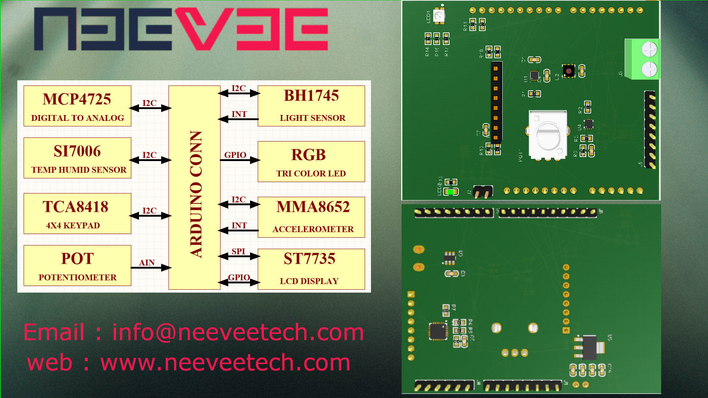

# nrf52-accessory-shield

Block Diagram
-------------

Features
--------
 - Arduino Compatible
 - RGB TRICOLOR LED
 - BH1745 Light Sensor
 - MMA8652 Accelerometer
 - SI7006 Temperature / Humidity Sensor
 - MCP4725 Digital to Analog Convertor
 - TCA8148 4x4 Keypad controller
 - Potentiometer
 